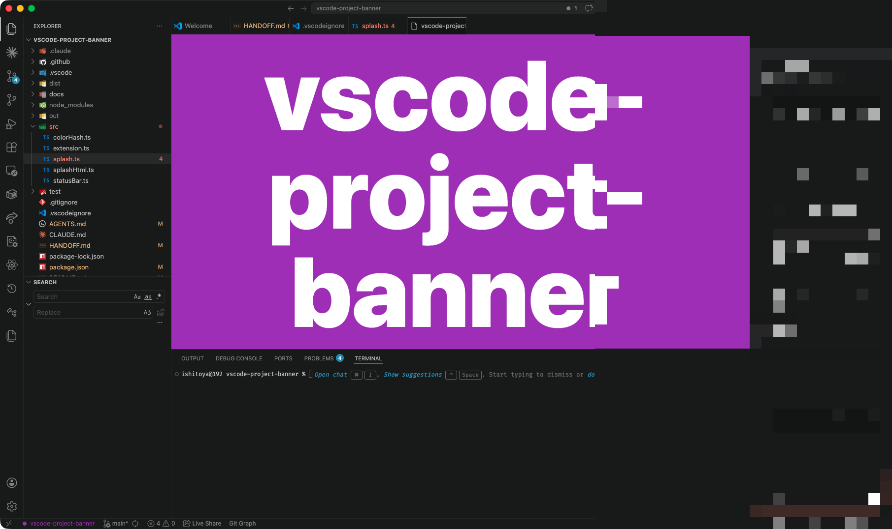

# Project Banner for VSCode

A VSCode extension that announces which project the current window belongs to, so you don't mix up windows when juggling several projects in parallel.

- A splash overlay flashes the project name across the editor when the window gains focus.
- A status bar item permanently shows the project name, tinted with a deterministic color derived from the name.
- The splash background and the status bar text use the exact same hue, so each project has a consistent visual identity.
- The splash dismisses on click / key press, or auto-fades after a configurable duration.

Built only on the official VSCode extension API — no CSS injection, no internal API hacks, no startup warnings.



## Why this exists

If you keep five VSCode windows open at once, the title bar alone (especially on macOS where it's tiny) is not enough to tell them apart. Color-only solutions like Peacock help but are easy to misread. Project Banner shows the **project name** as a large, color-coded visual anchor at the moment your eyes need it most: when you switch back to a window.

## Install

Download the latest `vscode-project-banner-*.vsix` from [Releases](https://github.com/kent013/vscode-project-banner/releases) and install it:

```sh
code --install-extension ./vscode-project-banner-*.vsix
```

Or, in VSCode, open the Extensions panel → "…" menu → **Install from VSIX…**.

After install, reload any open windows: `Cmd+Shift+P` → `Developer: Reload Window`.

### Remote-SSH

This extension is declared `extensionKind: ["ui"]`, which means **a single local install is enough** — it runs on the local UI side and works in Remote-SSH windows automatically. You do not need to install it on each remote host.

## Configuration

Open Settings (`Cmd+,`) and search for `projectBanner`:

| Setting | Default | Purpose |
| --- | --- | --- |
| `projectBanner.splash.enabled` | `true` | Show the splash overlay on window focus. |
| `projectBanner.splash.durationMs` | `3000` | How long the splash stays visible (ms). |
| `projectBanner.splash.fontSize` | `200` | Font size of the project name in the splash (px). |
| `projectBanner.splash.minIntervalMs` | `3000` | Minimum gap between splashes — prevents flicker on rapid focus toggling. |
| `projectBanner.statusBar.enabled` | `true` | Show the status bar item. |
| `projectBanner.statusBar.useWarningBackground` | `false` | Apply the warning background color to the status bar item for stronger emphasis. |
| `projectBanner.text` | `""` | Override the displayed text. Empty means "use the workspace name". |

## When does the splash appear?

The splash fires when **all** of the following are true:

1. The window's focus state transitions from unfocused to focused (you came back from another app or another VSCode window).
2. At least `splash.minIntervalMs` has elapsed since the last splash (default 3000 ms throttle).

It does **not** fire on activation / reload, because by the time the extension activates the window is already focused, so no focus-change event is observed. To force a splash on demand, use the command palette: `Project Banner: Show splash now` — it ignores the throttle.

Click the splash, or press any key while it has focus, to dismiss it immediately.

## Color matching

The project name is hashed (FNV-1a) into an HSL hue, kept at fixed saturation/lightness for readability. The same hue is used for:

- The splash background.
- The status bar item text color (rendered as `● <project name>` so the dot and text both pick up the color).

Different projects therefore get distinct visual identities, and within a single project the splash and the status bar always agree on the color.

## Development

```sh
npm install
npm test                # 21 unit tests for colorHash and splashHtml
npm run dev             # launch an Extension Development Host
npm run install:local   # build a .vsix and install it into your local VSCode
npm run uninstall:local # remove the local install
```

### Releasing

```sh
npm version patch        # bumps version, commits, creates git tag
git push --follow-tags   # pushes main and the new tag
```

Pushing a `v*` tag triggers `.github/workflows/release.yml`, which builds a `.vsix` and attaches it to a GitHub Release automatically.

## License

Personal use intended. MIT license planned.

## Design notes

The detailed design rationale — what was tried before, why each scope choice was made, and the API constraints that shape the implementation — lives in [AGENTS.md](AGENTS.md). Session-to-session handoff notes are in [HANDOFF.md](HANDOFF.md).
